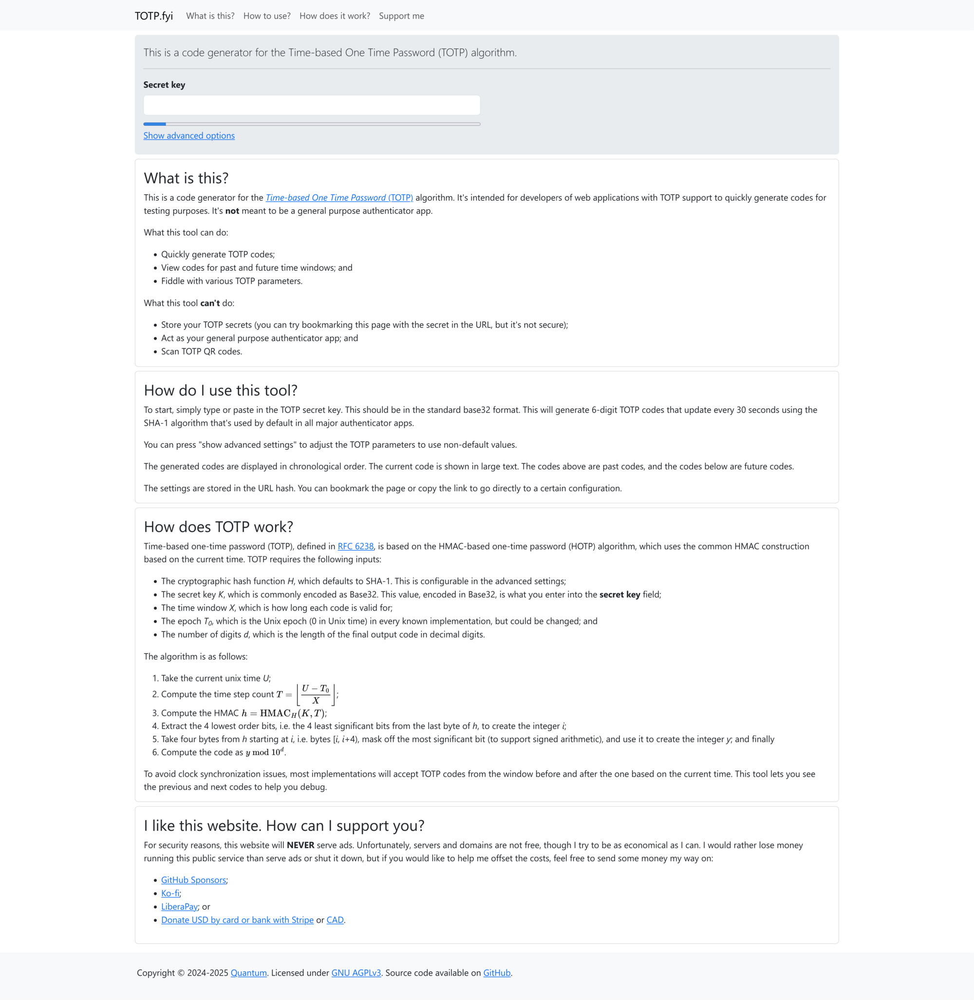

# TOTP

This is a code generator for the Time-based One Time Password (TOTP) algorithm.
It's intended for developers of web applications with TOTP support to quickly
generate codes for testing purposes. It's not meant to be a general purpose
authenticator app.

What this tool can do:

* Quickly generate TOTP codes;
* View codes for past and future time windows; and
* Fiddle with various TOTP parameters.

What this tool can't do:

* Store your TOTP secrets (you can try bookmarking the URL with the secret, but
  it's not secure);
* Act as your general purpose authenticator app; and
* Scan TOTP QR codes.

